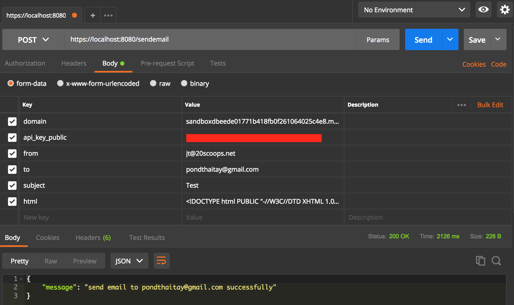

# Service Email
This project is simple APIs for sending email by [Mailgun](https://www.mailgun.com/) 🔫

This document assumes that you have a working [Go development environment.](https://golang.org/doc/install)

# Usage
1. Sign up Mailgun ([link](https://signup.mailgun.com/new/signup))
2. Add your domain in Mailgun but this example use Sandbox Domains
3. Clone project :joy:
4. Open terminal or cmd
5. Go to directory proojet and use command `go run main.go`
6. Test upload image by [Postman](https://www.getpostman.com/)

This project requires the 8 parameters specified to connect Mailgun.

| Parameter  | Description | 
| :---         |     :---     |
| domain   | Domain Name in Mailgun | 
| api_key_public | Public Validation Key in your account Mailgun |
| api_key_private | Private API Key in your account Mailgun |
| from | Sender of the message as reported by From message header, for example “Pond <pond@example.com>” |
| to | Email for recipient of the message |
| subject | Subject for send Email |
| body (optional) | Message for send Email |
| html (optional) | String html format inlined, for example `<b>Text Bold</b>` |

### Note
* If you use Sandbox Domains must add email recipient to domain by Mailgun because it use for test only. 🔥
* You must only provide field `body` or `html` but if you use both, APIs will use field `body` instead.

# Features
We supports : 
* Attachments
* HTML file
* Embedded images